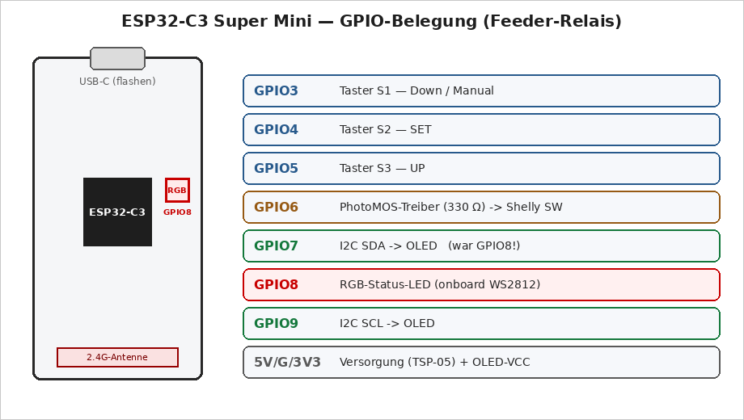
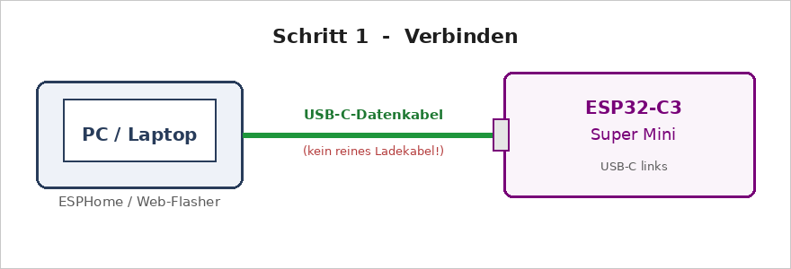
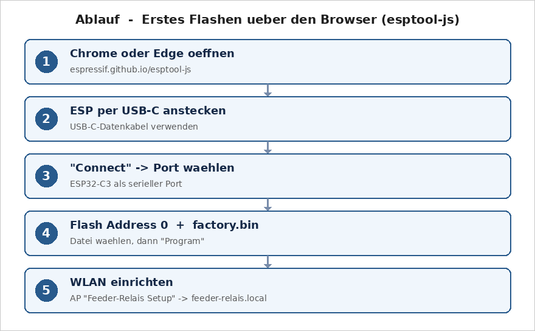

# Timer Replacement PCB — Complete Documentation

> **Translation.** This is the English translation of the manual. The authoritative version is the German original ([Deutsch](DOKUMENTATION.md)). Also available: [Français](DOKUMENTATION.fr.md).

**Project:** Replacement of a defective/outdated timer control PCB with an
in-house development using an ESP32-C3, OLED display, Wi-Fi configuration and a
Shelly 1PM Mini Gen4 as the power switch.

**Status/Date:** 2026-07-13 · Template version v8 · Phase: verification before layout
**Author:** Silvio (hardware/measurements) + Claude (analysis/design)

---

## 1. What the device does (functional description)

The device has three buttons on the front. Pressing a button switches a 230 V
load on for an adjustable time:

| Button | Default time | adjustable |
|--------|--------------|-----------|
| T1     | 5 seconds    | 1–600 s via Wi-Fi |
| T2     | 10 seconds   | 1–600 s via Wi-Fi |
| T3     | 15 seconds   | 1–600 s via Wi-Fi |

A small OLED display behind the viewing window shows the **Wi-Fi reception**
(left) at the top, the large **time of day** (NTP, center) and the status
"Ruhe" (Idle, right); at the bottom left the **date** (e.g. "Do 16.07.2026") and
at the bottom right the **free memory**. While a timer is running, the center
shows the **seconds countdown** and the right shows "Futter" (Feed). The three
buttons (**S1 Down/Manual**, **S2 SET**, **S3 UP**) trigger timers, stop them
and page through an info menu — details in Ch. 6.5.

Operation runs **without an app and without a cloud** via a small web page
optimized for mobile devices, which the ESP32 serves itself on **port 80** (open
`http://feeder-relais.local` in the browser): trigger buttons, set times, view
network and status values. For integration (e.g. with ioBroker) the ESP
additionally offers a lean **JSON API** (see Ch. 6.4). Optionally, the device can
also be integrated into Home Assistant or ioBroker (esphome adapter).

### 1.1 The signal chain (this is how the signal flows)

```
Taster ──> ESP32-C3 ──> Vorwiderstand 330 Ω ──> PhotoMOS-Relais ──> Shelly
(T1–T3)    (zählt die     (begrenzt den           (schaltet 230-V-      SW-Eingang
            Zeit, steuert  LED-Strom im            Signal galvanisch     │
            das OLED)      PhotoMOS)               getrennt)             ▼
                                                                    Shelly-Relais
                                                                    schaltet Last (O)
```

**Why a Shelly?** The Shelly 1PM Mini Gen4 handles the actual switching of the
load, measures the power in the process, and is additionally reachable via
Wi-Fi/app. Our board only "presses" the switch for the Shelly — as a real
hardware signal, **without a Wi-Fi dependency** for the core function.

**What is a PhotoMOS?** A tiny solid-state relay: on one side an LED (driven by
the ESP with 3.3 V), on the other side a light-controlled switch that is allowed
to switch mains voltage. Between them there is only light — i.e. a complete
galvanic isolation between low voltage (SELV) and 230 V. The Shelly's SW input is
mains-referenced (it expects a switched L), which is why a type with **≥ 400 V
reverse voltage is mandatory** (e.g. Omron G3VM-601BY or Panasonic AQY216). An
ordinary optocoupler (PC817) is **not** permissible here.

The Shelly is configured to input mode **"Switch/Follow"**: its relay is on for
exactly as long as the ESP holds the signal. The timing is entirely up to the
ESP.

---

## 2. Safety — read this first

- The device works with **230 V mains voltage. Danger to life!** Assembly,
  testing and commissioning belong in the hands of a suitably qualified person
  (a qualified electrician or an instructed person).
- Initial functional tests of the ESP, buttons and OLED are performed
  **exclusively over USB** — with no mains voltage connected whatsoever (see the
  test plan in the project plan).
- The first 230 V test is performed behind an **RCD/PRCD (portable residual
  current device plug)**, with the enclosure closed; never work on the open
  device while it is powered.
- On the board the rule is: at least **6 mm of distance** (creepage distance)
  between all 230 V nets and the low voltage (SELV); details in Ch. 7.6.
- A fuse (1 A slow-blow) and a varistor upstream of the power supply module are
  mandatory — the modules (TSP-05/HLK) do not bring either of them along
  themselves.

---

## 3. Bill of materials (BOM)

| Ref | Component | Value / type | Note |
|-----|-----------|-----------|------|
| U1  | ESP32-C3 Super Mini | 18 × 24 mm, USB-C | controller, Wi-Fi |
| U2  | PhotoMOS relay | Omron G3VM-601BY **or** Panasonic AQY216 | ≥ 400 V! SOP-4/DIP-4 |
| PS1 | AC/DC module | TENSTAR TSP-05 (5 V / 3 W) | HLK-PM05 clone, 34.7 × 20.5 × 15.05 mm, **measure pin spacing!** |
| —   | Shelly 1PM Mini Gen4 | S4SW-001P8EU | 29 × 34 × 16 mm, max. 8 A/240 V |
| —   | OLED display | 0.91" SSD1306, 128 × 32, I2C | module 38 × 12 mm, pins: GND VCC SCL SDA, address 0x3C |
| SW1–3 | Short-travel button | 6 × 6 mm, travel 1.5 mm | pin pattern 6.9 × 4.4 mm (measured from the original) |
| R1  | Resistor | 330 Ω, axial | LED series resistor for PhotoMOS |
| F1  | Fine-wire fuse | 1 A slow-blow, 5 × 20 mm + holder | primary side |
| RV1 | Varistor (MOV) | S14K275 | primary side, in parallel |
| C1  | Electrolytic cap | 220 µF / 10 V | 5 V buffer for Wi-Fi current peaks |
| C2  | Ceramic cap | 100 nF | 5 V decoupling |
| J1  | Mains terminal | 2-pole (L, N) | screw terminal or solder pads |
| J2  | Shelly connection | 4 solder pads/pins | L, N, SW, O — short wires to the Shelly screw terminals |
| J3  | Load output | 2-pole | O (switched), N |
| J4  | OLED socket | socket header 1 × 4, pitch 2.54 | build height per stack measurement (~11 mm), Ch. 5.6 |
| —   | Pin header 1 × 4 | pitch 2.54 | soldered to the OLED (facing backward) |
| —   | Mounting material | 3M VHB adhesive tape or 3D clip | fastening the Shelly + TSP |

---

## 4. Enclosure and mechanics

### 4.1 The coordinate system (important for everything that follows!)

All dimensions refer to the **upper left corner of the ORIGINAL PCB**, x to the
right, **y downward**, viewed from the **component side** (buttons at the top).
The new, larger board extends beyond this origin — which is why there are
**negative coordinates**. Advantage: all values ever measured remain valid
forever, no matter how the contour grows.

### 4.2 Boundary conditions from the enclosure (measured/derived)

| Quantity | Value | Source |
|-------|------|--------|
| Inner overall height | 19.9 mm | measurement Silvio |
| Frame height (front panel) | 2 mm | measurement Silvio |
| Space **above** the board | **16.5 mm** | measurement Silvio (board ↔ front) |
| Board thickness | 1.6 mm | standard |
| Space **below** the board | **≈ 1.8 mm** | 19.9 − 16.5 − 1.6 → nothing may protrude downward! |
| Height limit in the window area | **≈ 12 mm** | glass + OLED plugged in front of it |
| Board fastening | 4 screws on 16.5 mm bosses on the front panel | with stabilizing ribs to the edge |
| Enclosure screwing | 6 external screws | the board has 6 edge-open U-slots (width 10) instead of closed feed-throughs |

### 4.3 Final board geometry (template v9)

All values are stored **machine-readable** in `hardware/platine_template.py`
(the single source of truth!). Summary:

| Element | Coordinates (mm) | Accuracy |
|---------|------------------|-------------|
| Contour | x −14.2…91.1 / y −11.8…67.6 → **105.3 × 79.4**, corner radius 4 (locally reduced to 3.2 and 2.1 respectively at the outer boss slots) | ±1 (left ±1.5) |
| 4 mounting holes ⌀3.0 | (3.8/4.1) (73.1/4.0) (3.7/39.6) (73.4/50.7) | ±0.3 |
| 6 boss slots (edge-open U, width 10) | upper row y −6.0 (opens toward the top edge), lower row y +64.0 (opens toward the bottom edge), row spacing 70; columns x −6.0 / 39.0 / 84.0 (pitch 45) | measured directly (Silvio 13.07.); absolute position still to be **test-fitted** |
| Buttons T1/T2/T3 (centers) | (13.2/12.3) (38.8/12.2) (64.1/12.0) | ±0.3 |
| Viewing window (reference) | x 18.4…53.6 / y 23.3…40.0 | ±1 |
| J4 OLED socket (4 pins vertical) | pins at x = 15.0, y = 27.84 / 30.38 / 32.92 / 35.46 | check assumptions, Ch. 5.6 |
| Mounting area Shelly | x 56…90 / y 16.5…45.5 (horizontal) | — |
| Mounting area ESP32-C3 | x 8.5…32.5 / y −10…8 (transverse, USB upward) | — |
| Mounting area TSP-05 | x −1.5…33.2 / y 44.2…64.7 (AC side to the left) | — |
| Keepouts (reference) | ⌀8 around the 4 screw heads + 5 rib bands | rib directions = assumption! |

**Where do the values come from?** Solder-side scan of the original PCB (300 dpi,
de-rotated, mirrored) for buttons/holes/contour; enclosure scan, registered via
the 4 frame screws (mirror transformation `x_platine = 110,5 − x_gehäuse`,
`y_platine = y_gehäuse − 16,4`, ±0.4 mm); window position from the
perspective-corrected photo.

### 4.4 The old cutout

The trapezoidal cutout on the bottom edge of the original PCB was the clearance
for the middle lower screw boss (B5). In the new board it is **replaced by the
edge-open U-slot B5** and is omitted.

---

## 5. Electronics in detail

### 5.1 Overview of the nets (connections)

| Net name | carries | connects |
|----------|-------|-----------|
| L_IN | 230 V | mains terminal J1.L → fuse F1 |
| L_F | 230 V (fused) | F1 → varistor, TSP-05 AC, PhotoMOS OUT1, Shelly L |
| N | 230 V neutral | J1.N → varistor, TSP-05 AC, Shelly N, load J3 |
| SW_SHELLY | 230 V switched | PhotoMOS OUT2 → Shelly SW |
| O_LAST | 230 V switched | Shelly O → load output J3 |
| +5V | low voltage (SELV) | TSP-05 +Vo → ESP 5V, C1, C2 |
| GND | low voltage (SELV) | TSP-05 −Vo → ESP GND, buttons, PhotoMOS K, OLED |
| +3V3 | low voltage (SELV) | ESP 3V3 output → OLED VCC |
| BTN1/2/3 | signal | buttons → GPIO3/4/5 (internal pull-ups) |
| PMOS_DRV → PMOS_A | signal | GPIO6 → R1 330 Ω → PhotoMOS anode |
| SDA / SCL | I2C | GPIO7 / GPIO9 → OLED |
| RGB-LED | signal | GPIO8 → onboard WS2812 (status LED, dimmed) |

### 5.2 ESP32-C3 Super Mini: board and pin assignment

Module variant "ESP32-C3FN4". An overview of the pins we use:



Components on the module: **1** USB Type-C · **2** BOOT button · **3** RESET button ·
**4** LDO CAT6219 (3.3 V, 500 mA) · **5** ESP32-C3FN4 · **6** 2.4 GHz antenna ·
**7 RGB module (WS2812, GPIO8)** · **8** antenna connector (u.FL).

| Pin | Function | Note |
|-----|----------|-----------|
| 5V / G | supply | from the TSP-05 |
| 3V3 | output of the onboard LDO | supplies the OLED |
| GPIO3 | button T1 | pull-up internal, button to GND |
| GPIO4 | button T2 | ditto |
| GPIO5 | button T3 | ditto |
| GPIO6 | PhotoMOS driver | high = Shelly on |
| GPIO7 | SDA (I2C) | OLED — **instead of GPIO8**, which is where the RGB LED sits |
| GPIO8 | RGB LED (WS2812) | onboard status LED, dimmed |
| GPIO9 | SCL (I2C) | OLED |

Deliberately avoided: GPIO2/8/9 as buttons (strapping pins). **GPIO8 carries the
onboard RGB LED (WS2812)** — which is why I2C **SDA is on GPIO7** (not GPIO8),
otherwise the I2C traffic would drive the LED brightly (heat). SCL stays on GPIO9
(boot-compatible with an I2C pull-up).

### 5.3 Shelly 1PM Mini Gen4

- Terminals: **SW** (switch input), **O** (load output), **L**, **N**.
- Supply 110–240 V~, relay max. 8 A / 2000 W @ 240 V.
- Configuration after commissioning: *Input Mode = Switch (Follow)*, so that the
  relay follows the SW signal 1:1.
- Mounting: lying flat on the mounting area, VHB adhesive tape or 3D clip. Four
  short wires (e.g. 0.75 mm², 6–7 mm stripped) from the screw terminals to the J2
  pads.

### 5.4 Power supply TSP-05

100–240 V~ → 5 V DC / 3 W (= 600 mA). Sufficient for the ESP Wi-Fi peaks
(~350 mA) plus the OLED with reserve. **Open item: check the pin spacing with
calipers against the KiCad footprint `Converter_ACDC_HiLink_HLK-PMxx`** (the
clone is usually pin-compatible — but at 230 V, assume nothing).

### 5.5 Buttons

The three 6×6 short-travel buttons (1.5 mm travel) are actuated by plungers in
the front panel — their position is therefore **non-negotiable** (place them to
within ±0.2 mm). Pin pattern per button: 6.9 mm × 4.4 mm.

### 5.6 OLED — plug-in mounting ("stack")

The OLED is **not soldered**, but **plugged onto J4**: socket header 1×4 on the
board, pin header on the OLED facing backward, the display face rests against the
glass pane (with a thin foam pad).

- Assignment of J4 from top to bottom: **GND, VCC (3V3), SCL, SDA** — identical to
  the labeling of the existing module.
- **Required stack height** = 16.5 mm − glass inset − module thickness (≈ 2.8 mm)
  ≈ **13–14 mm**. Realized for example with an 11 mm socket header + 2.5 mm pin
  header collar. Socket headers are available in 8.5/11/13/15 mm.
- **Measure on the real module before freezing** (manufacturers vary by ±1 mm):
  1. distance module left edge → pin row (assumption 2.5 mm),
  2. distance module left edge → center of the active area (assumption 23.5 mm),
  3. glass inset (front inner face → underside of glass).
  In practice: lay the module in the frame, display centered in the window,
  measure the pin holes relative to two boss screws → that is J4.

---

## 6. Firmware (ESPHome)

File: `firmware/timer-relais-c3.yaml` (device name **`feeder-relais`**, mDNS
`feeder-relais.local`). Contains everything: Wi-Fi with fallback hotspot
("Feeder-Relais Setup", captive portal), **NTP clock** (`de.pool.ntp.org`),
mobile web app + JSON API (Ch. 6.4), the three persistent times, button logic
with debounce/long press/menu (Ch. 6.5) and an OLED with Wi-Fi status, clock or
countdown.

### 6.1 First flashing — step by step (for beginners)

The **very first time**, the firmware is put onto the ESP32-C3 **via a USB
cable**. All later updates then run wirelessly (Ch. 6.6).

**This is what you need:**

- the **ESP32-C3 Super Mini**,
- a **USB-C data cable** — caution: many cheap cables can only *charge*; with
  those the chip is **not detected**!
- a PC with **Google Chrome** or **Microsoft Edge** (browser route B) — or
  ESPHome on the PC (route A).



**Ready-made images are available** — so you don't have to compile anything
yourself:

- in the repo under **`firmware/build/`** (always the current state):
  - `feeder-relais.factory.bin` — full image for the **first flash** (address 0x0)
  - `feeder-relais.ota.bin` — app image for **OTA/web update** (Ch. 6.6)
- as a **GitHub release** (versioned file name, e.g.
  `feeder-relais-v0.0.1.factory.bin`) in the *Releases* section of the repository.

Build it yourself: `./firmware/build_images.sh` (compiles and updates
`firmware/build/`). Otherwise the raw files are located under
`firmware/.esphome/build/feeder-relais/.pioenvs/feeder-relais/`.

> **The images contain NO Wi-Fi credentials.** Setup runs after flashing via the
> setup hotspot (Ch. 6.2). This way no foreign Wi-Fi ends up in the delivered
> product, and the configured data survives OTA updates (fixed storage key).

#### Route A — with ESPHome (recommended, one command)

A `secrets.yaml` is **not** needed — no Wi-Fi data is compiled in.

1. Plug in the ESP via **USB-C**.
2. Run in the project folder:
   ```
   esphome run firmware/timer-relais-c3.yaml
   ```
   ESPHome compiles, asks for the **serial port** (Linux e.g. `/dev/ttyACM0`,
   Windows a `COMx`) and flashes.
3. After the restart the ESP opens the setup hotspot → continue with Ch. 6.2.

> **Linux tip:** On "Permission denied" for `/dev/ttyACM0`, add your user to the
> group `dialout`: `sudo usermod -aG dialout $USER` (log in again).

#### Route B — in the browser, without installation (esptool-js)

For the ready-made `firmware.factory.bin` entirely without ESPHome:



1. In **Chrome/Edge** open the page **`https://espressif.github.io/esptool-js/`**.
2. Plug in the ESP via a **USB-C data cable**.
3. Leave the baud rate at `115200`, click **Connect** and select the ESP's serial
   port in the window (often called "USB JTAG/serial debug unit" or a `COMx`).
4. Enter `0` at **Flash Address**, use **Choose File** to select the
   `firmware.factory.bin`, then **Program**. Wait until "Hard resetting…"
   appears.
5. Continue with the Wi-Fi setup (Ch. 6.2).

> If "Connect" does not work: force **boot mode** — hold **BOOT**, briefly tap
> **RESET**, release **BOOT**, then "Connect" again.

### 6.2 After flashing: set up Wi-Fi

The firmware **deliberately brings no** Wi-Fi credentials with it — after
flashing the ESP starts its own **setup hotspot**:

1. On your phone/PC connect to the Wi-Fi **"Feeder-Relais Setup"** (password
   **`feeder1234`**).
2. A **captive portal** opens (otherwise open `http://192.168.4.1`).
3. Select your home Wi-Fi, enter the password, save — the ESP restarts and
   connects.
4. From now on reachable at **`http://feeder-relais.local`**.

**Persistence & factory reset:**

- The entered Wi-Fi data is stored under a **fixed storage key** and is
  **preserved across OTA/web updates** (Ch. 6.6) — set up once, then never again.
- For a **factory reset** (deleting the old Wi-Fi data), flash the **factory image
  with flash erase**: tick "Erase all flash" in the web flasher, or run
  `esptool.py erase_flash` before writing. A pure OTA update does **not** delete
  the data.

### 6.3 Troubleshooting when flashing

| Symptom | Cause / solution |
|---|---|
| ESP is not detected at all | **charge cable** instead of data cable → different USB-C cable, different USB port |
| No port in the browser | use Chrome/Edge (WebSerial); on Windows possibly the **CH340**/**CP210x** driver; a C3 with native USB usually needs none |
| "Connect" fails | **boot mode**: hold BOOT + tap RESET + release BOOT |
| Linux "Permission denied" | user in group `dialout` (`sudo usermod -aG dialout $USER`) |
| No `…​.local` after the flash | first set up Wi-Fi via the setup hotspot (Ch. 6.2); mDNS takes a moment |

> After the first flash all updates go **wirelessly** (Ch. 6.6) — the USB socket
> may well be poorly accessible in the installed state.

### 6.4 Web operation and JSON API (port 80)

`http://feeder-relais.local` opens a mobile web app with five tabs:

- **Start:** three large buttons (trigger T1/T2/T3 with their configured time),
  live countdown and **Stop**.
- **Times (settings):** at the very top the **language selection**
  (Deutsch/English/Français), below it the three timer times (1–600 s), stored
  persistently.
- **Network (configurable):** Wi-Fi (SSID/password), IP mode **DHCP/static**
  (+ IP/gateway/mask/DNS), **NTP server**, a **hostname** (default
  `feeder-relais`), a switch for **Wi-Fi roaming (802.11k/v)** and a **restart**
  button.
- **Status:** firmware, uptime, free memory, Wi-Fi, SSID with **channel · colored
  signal bar · signal** (dBm; 1 bar red, 2 yellow, 3–4 green), **Wi-Fi roaming
  (802.11k/v) ON/OFF**, IP/MAC, reset reason, relay.
- **Service:** live **log** (display level ERROR/WARN/INFO/DEBUG selectable,
  can be enabled), **firmware update** (.bin upload, Ch. 6.6) and **restart**.

**Language (multilingual interface):** The web app and the OLED speak **German,
English and French**. The selection is **at the very top of the Times tab** and
applies **device-wide** (web *and* OLED), stored in `g_netcfg.lang` (persistent,
default German). The web texts are stored as a JS dictionary in the page
(switching without reload); language-dependent status values (Wi-Fi state, reset
reason) come from the firmware as neutral codes and are translated in the
browser. The OLED translates weekdays, the status (Idle/Feed) and the menu titles
(deliberately without accents because of the display's character set). The manual
itself is additionally available in [English](DOKUMENTATION.en.md) and
[French](DOKUMENTATION.fr.md) (the German version is authoritative).

In the **header** are the **hostname** and a **status dot**: green = all is well,
yellow = a timer is running, red = fault in the idle state (e.g. OLED not
reachable or no Wi-Fi). The **same traffic light** is shown on the device by the
dimmed **onboard RGB LED** (WS2812 on GPIO8, see Ch. 5.2).

Technically, `firmware/timer_web.h` (with `firmware/net_config.h` for the
persistent network config) serves this page as its own `AsyncWebHandler` on
`web_server_base` (the native ESPHome web UI is disabled). The same **JSON API**
is also used for integration (e.g. ioBroker) — parameters as a query string,
method GET **or** POST:

| Endpoint | Effect |
|----------|---------|
| `GET /api/status` | JSON with all values: `active, remaining, relay, last, times[3], host, ip, ssid, rssi, mac, ap, fw, uptime, heap, wifi, reset, lang, roaming` (`wifi`/`reset` are language-neutral codes that the web JS translates) |
| `POST /api/trigger?button=N` | trigger button N (1–3) (uses its configured time) |
| `POST /api/trigger?seconds=N` | switch on ad hoc for N seconds |
| `POST /api/stop` | switch off immediately |
| `POST /api/config?time1=A&time2=B&time3=C` | set times (each 1–600 s, persistent) — fields can also be set individually |
| `GET /api/net` | read network config: `static, ip, gw, sn, dns, ntp, hostname, roaming, lang` |
| `POST /api/net?static=0\|1&ip=&gw=&sn=&dns=&ntp=&host=&roaming=0\|1&lang=de\|en\|fr` | save network config (fields individually, persistent) |
| `POST /api/wifi?ssid=&pw=` | set Wi-Fi credentials (reconnects) |
| `POST /api/reconnect` | cleanly reconnect Wi-Fi (applies e.g. changed roaming immediately) |
| `POST /api/reboot` | restart the device |
| `GET /api/log?level=N&since=M` | log ring buffer as JSON (lines with level ≤ N, `seq` > M); level 1=ERROR…5=DEBUG |

**Applying the network config:** The values are stored in the ESPHome preferences
(flash). The **NTP server** takes effect at the next sync
(`esp_sntp_setservername`). The **static IP** is set at `wifi.on_connect` via the
ESP-IDF netif and is therefore active after a **restart** (DHCP is the default).
**Wi-Fi** uses ESPHome's own `save_wifi_sta()`; initial access always via the
captive portal. The **hostname** is switched at runtime: mDNS (`…​.local`)
immediately via `mdns_hostname_set()`; the DHCP name (in the router) by a
**restart of the DHCP client** (`esp_netif_dhcpc_stop/start` → fresh DISCOVER with
option 12), i.e. also without a reboot. The name also appears in the **header** of
the web app and in the browser tab. It is reduced to a valid DNS label (a–z, 0–9,
"-").

**Wi-Fi roaming (802.11k/v):** The *capability* is compiled in permanently
(`enable_btm`/`enable_rrm` in the YAML → `CONFIG_WPA_11KV_SUPPORT` in the
wpa_supplicant); the **on/off** is toggled at runtime by the web switch via
`g_netcfg.roaming` (persistent). *On* sets in the STA config the bits 802.11v
**BTM** (`set_btm`, the AP/router can specifically re-book the device onto the
stronger AP) and 802.11k **RRM** (`set_rrm`, neighbor AP lists) and turns off
ESPHome's own scan roaming (the driver takes over); *off* does the reverse
(`set_post_connect_roaming(true)`). Only sensible with **multiple access points
with the same SSID** (UniFi/mesh) and when these support 802.11k/v. The bits only
go into the STA config at the **next (re)connect**; for that there is the button
**"Reconnect now"** in the same card (`POST /api/reconnect` →
`wifi.disable`+`enable`, which briefly disconnects the Wi-Fi), otherwise it takes
effect at the next restart. Default: **off**. The checkbox **continuously mirrors
the device's real state** (from `/api/status`) and therefore stays visibly ticked
after reconnecting; the setting is written to flash **immediately and durably**
(`netcfg_save()` calls `global_preferences->sync()`, since ESPHome's `save()` on
the ESP32 otherwise only queues it in RAM). The current state is also shown as a
row **"Wi-Fi roaming (802.11k/v): ON/OFF"** on the **Status** page.

Example ioBroker (set the time for button 1 to 8 s):
`POST http://feeder-relais.local/api/config?time1=8`.

### 6.5 Operation via the three buttons and OLED

The buttons are labeled on the enclosure: **S1 = Down/Manual**, **S2 = SET**,
**S3 = UP** (GPIO3/4/5).

**Normal state:**

- **short S1 / S2 / S3** → triggers timer 1 / 2 / 3 with the configured time
  (switches the Shelly on until the time expires).
- **long UP (S3) ≥ 1.2 s** → stops all timers and switches the Shelly **off**.
- **long SET (S2) ≥ 3 s** → opens the **info menu**.

**Info menu** (view only — configuration is done via the web app):

- **S1** pages forward, **S3** backward; **short SET** or **10 s without a press**
  closes the menu again.
- Pages: 1) Wi-Fi (SSID + signal) · 2) IP address · 3) time + NTP · 4) system
  (firmware + uptime).

**OLED display (128 × 32):**

- **Top:** Wi-Fi signal bars (from RSSI) on the left, the large **time of day**
  (HH:MM) or, while a timer is running, the **countdown** (e.g. "10 s") in the
  center, status **Idle/Feed** on the right; in the menu instead the page counter
  (e.g. "2/4").
- **Bottom:** on the left the **date** (e.g. "Do 16.07.2026"), on the right the
  **free memory** (kB).

The time base comes via NTP; until the first synchronization the clock shows
"--:--". Time zone `Europe/Berlin`. Weekday, status (Idle/Feed) and the menu
titles follow the **configured language** (Ch. 6.4).

### 6.6 Firmware updates (OTA)

After the first USB flash, **two wireless update routes** are set up:

- **Network OTA (ESPHome):** `esphome run firmware/timer-relais-c3.yaml` updates
  over Wi-Fi (port 3232) — USB no longer needed. Configured via
  `ota: platform: esphome`.
- **Web upload:** In the **Service** tab, upload the compiled `firmware.bin`
  (or directly `POST /update` on port 80). Configured via
  `ota: platform: web_server` — runs over `web_server_base`, the native ESPHome
  web UI is **not** needed for it. The device restarts automatically after the
  update.

The `firmware.bin` is created by `esphome compile …` and is located under
`.esphome/build/feeder-relais/.pioenvs/feeder-relais/firmware.bin`. The captive
portal can also install updates.

### 6.7 Service log / debugging

The **Service** tab shows the last log lines (ring buffer, 40 lines) filtered by
the selected level (ERROR/WARN/INFO/DEBUG) when "live display" is enabled.
Technique: `logger: on_message:` writes each line into `firmware/log_ring.h`; the
web endpoint `GET /api/log?level=&since=` delivers them as JSON. The logger runs
at `level: DEBUG` (for VERBOSE, raise the level in the YAML). Complete logs
additionally via `esphome logs …` (UART/network).

---

## 7. KiCad — step by step (also for beginners)

Tested against KiCad 8/9/10; menu names may differ slightly.

### 7.1 Create a project and import the schematic
1. Start KiCad → **File → New Project** → name `timer_ersatzplatine`, folder e.g.
   `hardware/kicad/`.
2. KiCad creates an empty `timer_ersatzplatine.kicad_sch`. **Replace this file in
   the explorer with our file** (same name!): copy in
   `hardware/timer_ersatzplatine.kicad_sch`.
3. Open the project, start the schematic editor. KiCad may convert the file to the
   current format — that is normal, just save.
4. Run **Tools → Electrical Rules Check (ERC)**. Warnings about "unconnected power
   pins" are known and non-critical (our symbols deliberately have no power-pin
   types); optionally silence them with PWR_FLAG symbols on +5V and GND.

### 7.2 Check/assign footprints
**Tools → Assign Footprints.** Pre-assigned are:

| Ref | Footprint | Action |
|-----|-----------|--------|
| SW1–3 | `Button_Switch_THT:SW_PUSH_6mm` | check (pin pattern 6.9 × 4.4) |
| PS1 | `Converter_ACDC:Converter_ACDC_HiLink_HLK-PMxx` | **check against the TSP-05 measurement!** |
| U2 | `Package_SO:SOP-4_4.4x2.6mm_P1.27mm` | for the DIP variant (AQY216 DIP): `Package_DIP:DIP-4_W7.62mm` |
| F1 | `Fuse:Fuse_5x20mm_Horizontal_ReferenceFuseHolder` | or the chosen holder |
| RV1 | `Varistor:RV_Disc_D12mm_W3.9mm_P7.5mm` | S14K275 fits |
| R1, C1, C2 | standard THT | ok |
| J1–J3 | pin header/terminal | J2 alternatively as 4 large solder pads |
| J4 | `Connector_PinSocket_2.54mm:PinSocket_1x04_P2.54mm_Vertical` | **socket** header! |
| U1 | — (empty) | **create yourself**, see 7.3 |

### 7.3 Create a footprint for the ESP32-C3 Super Mini
1. Open the footprint editor → new library `timer_project.pretty` (in the project
   folder, table "project-specific").
2. New footprint `ESP32-C3_SuperMini`: two pad rows 1×8, pitch 2.54, row spacing
   15.24 mm (= 6 × 2.54), pads ⌀1.7/hole 1.0. Outline 18 × 24 mm on F.Fab, mark
   the USB side.
3. Assign pad numbers according to the pinout image (left row 5V, G, 3.3, 4, 3, 2,
   1, 0 / right row 5, 6, 7, 8, 9, 10, 20, 21) and assign them in the schematic to
   symbol U1 (the symbol pin names 5V/G/3V3/3/4/5/6/8/9 must point to the correct
   pad numbers).

### 7.4 Generate the PCB from the schematic
Schematic editor → **Tools → Update PCB from Schematic**. All footprints land as a
heap next to the (still empty) board.

### 7.5 Import the contour and references
1. PCB editor → **File → Import → Graphics** →
   `hardware/platine_original_geometrie.dxf`.
2. The unit is automatically set to **mm** thanks to the DXF header; import first
   onto layer **User.Drawings**, position (0,0), scale 1.
3. **Dimension check:** measure T1→T2 with the measuring tool — it must give
   **25.6 mm**. If it is correct, continue; otherwise check the import settings.
4. Select the outer contour (**one closed line** — the 6 edge-open boss slots are
   already part of the contour, no longer separate circles) → Properties → change
   layer to **Edge.Cuts**. Everything else (button crosses, mounting areas,
   window, keepouts, texts) stays on user layers; optionally copy the mounting
   area frames including their labels additionally onto **F.Silkscreen** (helps
   with placement).
5. Set the 4 mounting holes as footprints: `MountingHole:MountingHole_3.2mm`
   exactly on the green crosses (position via **E** → type in the coordinates from
   Ch. 4.3).

### 7.6 Place and route
1. **Buttons first**: SW1–SW3 exactly on (13.2/12.3), (38.8/12.2), (64.1/12.0) —
   enter the position numerically, do not drag.
2. J4 on the pin crosses (first pin = GND at x 15.0 / y 27.84).
3. PS1/TSP on the mounting-area rectangle (AC pins toward the left edge), U1/ESP
   on its area (USB toward the top edge), J2 pads at the edge of the Shelly
   mounting area, J1 + F1 + RV1 in the 230 V corner at the bottom left,
   U2/PhotoMOS between the ESP area and the Shelly pads, R1 next to it, C1/C2 on
   the 5 V line near U1.
4. Create **net classes** (File → Board Setup → Net Classes):
   - `HV` (nets L_IN, L_F, N, SW_SHELLY, O_LAST): trace ≥ 0.8 mm (the supply path
     of the Shelly output O ≥ 2 mm at 8 A load!), clearance within HV ≥ 1.0 mm.
   - Standard (low voltage): 0.25/0.2 mm.
5. **The golden rule:** between every HV net and every low-voltage net **≥ 6.0 mm
   distance** — most easily via a custom rule (Board Setup → Custom Rules):
   ```
   (version 1)
   (rule HV_zu_LV
     (condition "A.NetClass == 'HV' && B.NetClass != 'HV'")
     (constraint clearance (min 6.0mm)))
   ```
   The only permitted "approach" is the PhotoMOS itself — its housing is the
   separation point (pins 1/2 = LV, pins 3/4 = HV).
6. No ground planes/zones in the HV area; no foreign traces under the TSP module.
7. Get **DRC** (Design Rules Check) free of errors.

### 7.7 Manufacturing data and ordering
1. **File → Fabrication Outputs → Gerbers** (standard layers) + drill files.
2. 3D view (Alt+3) as a final visual inspection.
3. Manufacturer (JLCPCB/PCBWay/Aisler): 2 layers, 1.6 mm FR4, lead-free HASL or
   ENIG, color does not matter. The outer contour including the 6 edge-open boss
   slots comes automatically from Edge.Cuts.
4. **Before submitting:** print the board 1:1 on paper (File → Plot → PDF, scale
   1:1), cut it out and test-fit it in the enclosure!

---

## 8. Assembly and commissioning

1. **Place the small parts** (order flat → tall): R1, C2, U2, buttons (exactly!),
   J4 socket header, C1, F1 holder, RV1, terminals.
2. **Prepare the ESP32-C3:** flash via USB (Ch. 6), test the Wi-Fi connection,
   then solder it onto the board (pin headers or directly).
3. **USB-only test:** power the ESP via USB (no mains!) — the buttons must start a
   countdown, the OLED plugged onto J4 must display, GPIO6 must switch
   (multimeter/LED on the PhotoMOS input).
4. **Solder in the TSP-05**, glue the Shelly onto the mounting area with VHB, four
   wires to J2 (L, N, SW, O), a wire to the load output.
5. **Visual inspection + continuity check:** no short between L/N/PE, ≥ 6 mm
   distances maintained, no solder splashes.
6. **First mains test:** enclosure closed, switch on via PRCD/RCD. The OLED shows
   clock/status → set up the Shelly via button/app (Wi-Fi, Input Mode "Switch") →
   button test with load.
7. Set the times as desired via `http://feeder-relais.local`.

---

## 9. File overview

| File | Content | Regenerable? |
|-------|--------|----------------|
| `hardware/platine_template.py` | **source of truth** for all geometry; parametric | source |
| `hardware/platine_original_geometrie.dxf` | DXF generated from it for KiCad | yes: `python3 platine_template.py` (needs `pip install ezdxf`) |
| `hardware/platine_vorschau.png` | render of the DXF | yes (render script see CLAUDE.md) |
| `hardware/timer_ersatzplatine.kicad_sch` | complete schematic (KiCad 8+) | hand-maintained |
| `firmware/timer-relais-c3.yaml` | ESPHome configuration | hand-maintained |
| `firmware/timer_web.h` | mobile web app + JSON API (C++ handler on web_server_base) | hand-maintained |
| `firmware/net_config.h` | persistent network config (IP mode, static IP, NTP, hostname, 802.11k/v roaming) | hand-maintained |
| `firmware/log_ring.h` | log/debug ring buffer for the Service tab (`/api/log`) | hand-maintained |
| `firmware/build/*.bin` | ready-made flash images (factory + ota), current state | generated |
| `firmware/build_images.sh` | compiles and updates `firmware/build/` | source |
| `docs/DOKUMENTATION.md` | this document (German **source**, authoritative) | hand-maintained |
| `docs/DOKUMENTATION.en.md`, `docs/DOKUMENTATION.fr.md` | manual in English/French (translation, updated per release) | hand-maintained |
| `docs/PROJEKTPLAN.md` | phases, status, checklists (German only) | hand-maintained |
| `CLAUDE.md` | working instructions for Claude Code | hand-maintained |
| `docs/DOKUMENTATION.pdf`, `docs/PROJEKTPLAN.pdf` | PDF versions (**mandatory with every change**) | yes: `python3 tools/md2pdf.py docs/*.md` |
| `tools/md2pdf.py` | Markdown→PDF generator (embeds images) | source |
| `docs/img/*.png` | diagrams of the flashing guide (Ch. 6.1) | generated (PIL) |

## 10. Change history of the geometry template

| Version | Change |
|---------|----------|
| v1 | first coordinates from perspective-corrected photos (±1–2 mm) |
| v2 | scanner measurement: 76.7 × 66.1, buttons/holes/cutout precise (solder-side scan) |
| v3 | enclosure fit 105.3 × 79.4, 6 boss cutouts ⌀10, old cutout omitted (= B5) |
| v4 | correction: no recessing possible (only 1.8 mm below) — window removed, Shelly on the mounting area at the right, 4th hole back, rib keepouts |
| v5 | TSP-05 planned instead of HLK (bottom left), ESP to the top left |
| v6 | OLED frame-mounted: window area freed up, J4 connection |
| v7 | labeled placeholders (DXF texts) |
| v8 | OLED plug-in mounting: J4 constructed vertically on the window centering |
| v9 | boss positions measured directly (Silvio 13.07.: pitch 45, row spacing 70, upper line 6 mm above the top edge, left column 6 mm beside the left edge → x −6/39/84, y −6/+64); 6 boss cutouts changed from ⌀10 holes to **edge-open U-slots** (more tolerant during insertion); corner radii at the outer slots locally reduced to 3.2/2.1; contour remains a closed Edge.Cuts loop (verified) |
